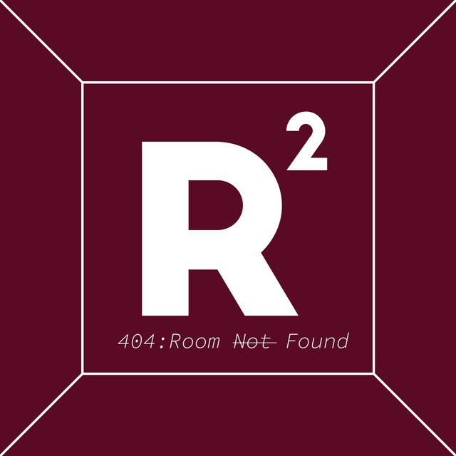
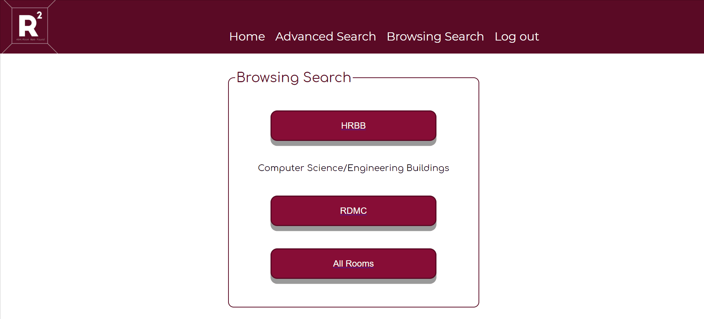
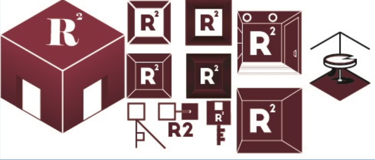

  
  <h1 align="center">R-squared</h1>
  <h3 align="center">TAMU Room Reservation Site</h3>

# Introduction
This repo contains code for the Room Reservation Website made for the Texas A&M course [CS-431: Agile Software Development with Ruby on Rails](http://faculty.cse.tamu.edu/ritchey/courses/csce431/winter19/).

Working prototype at https://r-squared.herokuapp.com/.

- [Introduction](#introduction)
  - [Functionalities](#functionalities)
    - [Home](#home)
    - [Browsing Search](#browsing-search)
    - [Advanced Search](#advanced-search)
  - [Web Design](#web-design)
    - [Layout Design](#layout-design)
    - [Function Design](#function-design)
    - [Logo Design](#logo-design)
- [Setup instructions](#setup-instructions)
- [About the development team](#about-the-development-team)
  - [Challenges](#challenges)

## Functionalities

There are 4 main pages in this app:
1. Login
2. [Home Page](#home)
3. [Browsing Search](#browsing-search)
4. [Advanced Search](#advanced-search)

### Home

At the Home page, you can: 
1. View your upcoming reservations
2. View your reservation history 
   - Table Form under *Show History* Button
   - Calendar View under *Calendar View* Button
3. Make a new booking

### Browsing Search

There are 2 buildings available in our database: RDMC & HRBB. At this page, you can see the floorplan for both of them and click on available rooms highlighted in green to see more details of the rooms.

### Advanced Search

Users can search for rooms based on specific filters and make booking there:

- Facilities available
- Building
- Room Type
- People Capacity
- etc

## Web Design

Color scheme of red & white, since the website was designed for TAMU.

### Layout Design

- Simple Layout with incorporation of rule of thirds
- Chunking information declutters webpages 

### Function Design

- Navigation bar - familiar to users and intuitive
- Forms - also another basic action that is user friendly

### Logo Design

Many iterations by [Siew Wen](https://github.com/lyqht) before we concluded on the logo above.

# Setup instructions

NOTE: To run this project locally, you must have **ruby v2.4.1** installed.
Assuming you have `bundler` installed already, 

1. Run `bundle install` in the terminal.
2. Run `rake db:migrate RAILS_ENV=development`
3. Go to localhost:3000 to see the website!

# About the development team

The team comprises of 4 TAMU students and 2 SUTD students.

TAMU: 
1. Anthony [@avoneiff](https://github.com/avoneiff)
2. Kim [@kimquynguyen](https://github.com/kimquynguyen)
3. Amy [@ahughes96](https://github.com/ahughes96)
4. Jordan

SUTD (contributed up to 1st Iteration while the TAMU students are in SG):
1. Siew Wen [@lyqht](https://github.com/lyqht)
2. Gio [@GioLim](https://github.com/GioLim)

## Challenges

- Logging in and creating a session for the user
- Showing the right thing at the right time (Reservations)
- Keeping everyone’s DB schema up to date and correct
- Using correct URL paths for controllers
- Google authentication 
- Learning the magic of Ruby and Rails